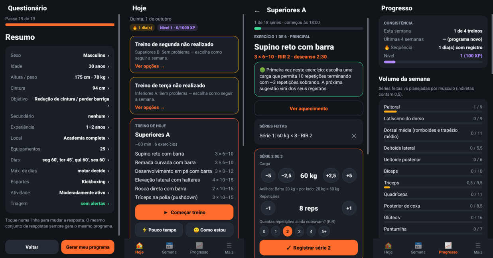
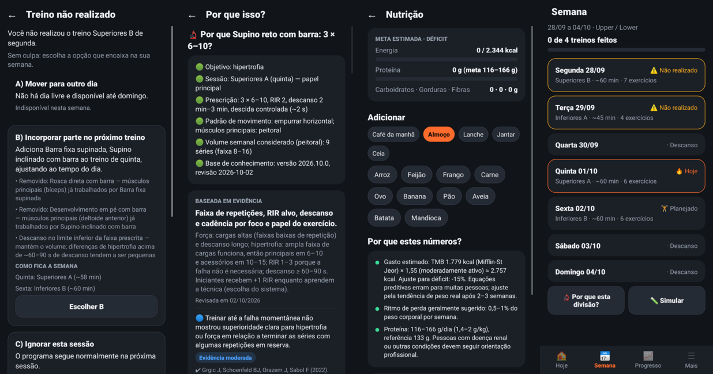
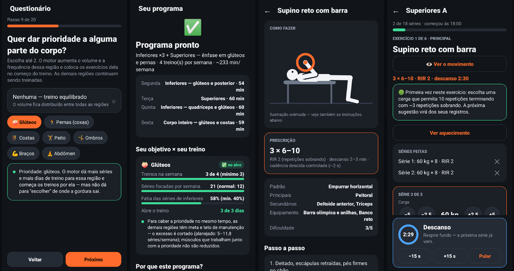
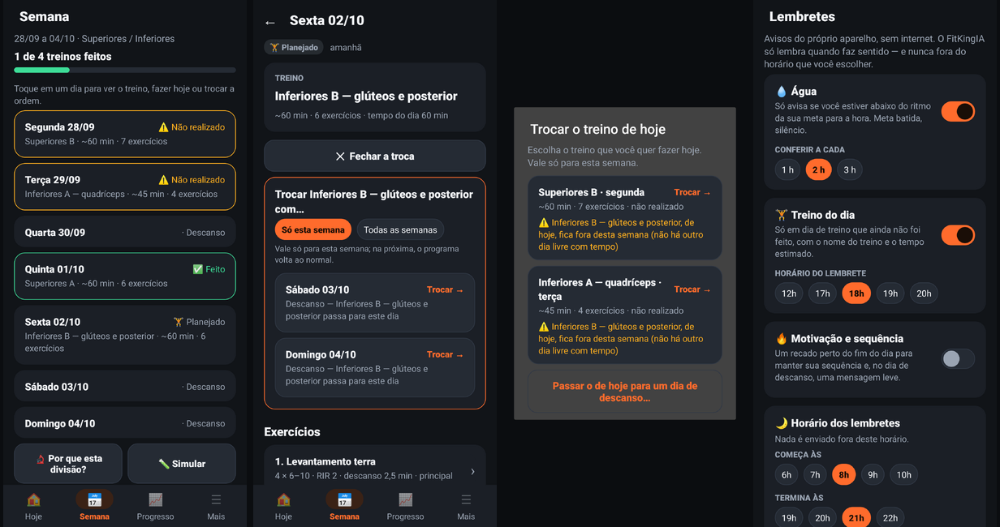

# FitKingIA

**Sistema de apoio à decisão para treino, composição corporal e hábitos — app Android offline, motor de regras e evidências rastreáveis.**

O FitKingIA não deixa uma IA "inventar treino". O treino sai de um **motor determinístico** (regras + banco de dados + evidências) a partir de um questionário respondido só com toques — offline, no aparelho, sem custo por uso. Toda recomendação responde à pergunta *"por que você está me recomendando isso?"* com a cadeia **recomendação → regra → evidência → fonte**.

```
🔵 FATO        "O ACSM (2026) associou ≥10 séries/semana a mais hipertrofia."      → vem de fontes verificadas
🟢 REGRA       "Para o seu perfil, o motor definiu 8–16 séries/semana, alvo 12."   → decisão determinística, auditável
🟣 ASSISTENTE  "Entendi: você tem 35 minutos hoje."                                → só na IA local da CLI; nunca decide prescrição
```

## 📱 App Android

**Baixe o APK:** [`dist/FitKingIA-0.2.0.apk`](dist/FitKingIA-0.2.0.apk) (Android 8.0+, ~1,8 MB, sem internet, sem conta). Instala por cima da 0.1.0 sem perder dados.
No celular: abrir o arquivo → permitir "instalar apps desconhecidos" para o gerenciador de arquivos/navegador → Instalar.

Tudo é **por toque** — nada para digitar:

1. **Questionário** (20 passos, alternativas e botões +/−): objetivo, **parte do corpo a priorizar** (ex.: glúteos), experiência, local e equipamentos, tempo de cada dia, esportes, atividade, triagem de segurança, dores, hidratação. No resumo, tocar numa linha volta à pergunta.
2. O **motor determinístico** gera o programa e mostra *por quê* (divisão, dias, volume por músculo, avisos) e **"Seu objetivo × seu treino"**: em números, se a região pedida recebe dias, séries focadas e lugar no começo do treino — ou por que não deu.
3. **Hoje**: treino do dia já ajustado; "⚡ Pouco tempo" (20–60 min) e "🙂 Como estou" (avaliação → índice de recuperação) refazem a sessão; "🔄 Trocar o treino de hoje" por outro da semana; treino perdido abre as opções A–D; água (+250/+500) e sono.
4. **Semana**: "‹ Anterior / Próxima ›" navega entre as semanas que passaram (só consulta: o que foi feito e o que ficou sem fazer), a atual e a próxima; tocar num dia mostra o treino; "Fazer este treino hoje" (desta semana) e "Trocar com outro dia" (de hoje em diante ou na próxima semana; só nessa semana ou todas), com avisos de pernas em dias seguidos ou perto do esporte e "↩️ Desfazer".
5. **Treino**: ilustração animada do movimento ("👁 Ver o movimento"), carga sugerida pelo seu histórico (dupla progressão), aquecimento, anilhas, séries por toque (carga, reps, RIR), cronômetro de descanso em anel com vibração, troca de exercício, resumo com recordes, XP e confete.
6. **Progresso**: consistência, volume semanal por músculo, 1RM estimado e tendência, sugestão de semana de descarga, recordes, peso e cintura (média móvel, IMC, cintura/altura), fotos de progresso.
7. **Mais**: **lembretes** (água só quando está abaixo do ritmo, treino do dia, sequência — notificações do próprio aparelho, desligadas até você ligar; depois do primeiro programa, um cartão na Hoje pergunta uma vez se você quer ligá-las), nutrição (alimentos TACO por toque), água, sono, cardio, mobilidade, suplementos, evidências, simulador "e se?", anilhas/1RM/aquecimento, perfil, dores, exportar e apagar dados.

As "fotos" dos exercícios são **ilustrações animadas desenhadas pelo próprio app** (110 movimentos, todos os 125 exercícios mapeados) — não usamos fotos de terceiros. Navegação com transições curtas, toques com mola e animações que respeitam a opção "remover animações" do Android.






> A IA de conversa (`coach`) continua no repositório e na CLI, mas **não entra no app**: o app é guiado só por alternativas, como pedido. Nenhuma parte usa LLM pago.

## Módulos

| Módulo | O que faz |
|---|---|
| [`core`](core/) | Domínio puro em Kotlin (sem IO, sem Android). Motores: triagem de segurança, gerador de programa, seleção e substituição de exercícios, volume semanal com contagem fracionada, ajuste ao tempo, agendamento com esportes, dupla progressão, PRs, tendência de 1RM, semana de descarga, índice de recuperação, prioridade por região com checagem "objetivo × treino", fadiga, dashboard de volume, treino perdido (A–D), simulador "e se?", hidratação, nutrição, IMC/cintura-altura, flutuação de peso, anilhas, aquecimento, gamificação e "🔬 Por que isso?". |
| [`knowledge`](knowledge/) | Banco de conhecimento: seeds JSON revisáveis → `fitness.db` (SQLite). 125 exercícios, 23 padrões de movimento, 15 divisões (inclui modelos com ênfase em glúteos e em pernas), 35 fontes verificadas, 28 afirmações (2 com evidência conflitante), 19 regras parametrizadas, alimentos TACO, 5 suplementos. Schema do `user.db`, validador de integridade e acesso SQL comum à JVM e ao Android. |
| [`appcore`](appcore/) | Lógica do app sem Android: questionário só de toque, repositório do `user.db` e casos de uso (programa, semana, treino perdido, autorregulação, execução, PRs, XP, água, sono, nutrição, corpo, exportação). Testado na JVM. |
| [`app`](app/) | App Android (telas em código, sem AndroidX) montado **sem o Android Gradle Plugin** — ver [ADR 0004](docs/adr/0004-apk-sem-agp.md). |
| [`coach`](coach/) | IA local de conversa em português (classificador + entidades + evidências), offline. Ver [docs/IA_LOCAL.md](docs/IA_LOCAL.md). |
| [`cli`](cli/) | `fitking`: ferramenta de terminal que exercita todos os motores e o chat. |

## Rodando

Requer JDK 21. Para o APK, as ferramentas Android livres do Ubuntu:

```bash
sudo apt-get install aapt dalvik-exchange libandroid-23-java zipalign apksigner zip

./gradlew build                                   # compila e roda os ~800 testes (inclui UI com Robolectric)
./gradlew :app:apk                                # APK assinado em app/build/outputs/ (+ checagem de API do Android 8)
./gradlew :app:test -Pscreenshots                 # capturas das telas em app/build/screenshots/
./gradlew :knowledge:buildKnowledgeDb             # gera knowledge/build/fitness.db + relatório de integridade
./gradlew :cli:installDist                        # instala o fitking em cli/build/install/fitking

F=cli/build/install/fitking/bin/fitking
$F demo                                           # passeio por todas as funções
$F programa                                       # programa do perfil de exemplo
$F porque supino                                  # 🔬 regra → evidência → fonte
$F substituir agachamento joelho                  # substituições com dor relatada
$F simular                                        # 3 × 4 × 5 dias
$F coach                                          # 💬 chat com a IA local (só na CLI)
```

## Princípios

1. **O motor decide.** Nenhuma prescrição sai de texto gerado; o app explica cada decisão com a regra e as fontes.
2. **Toda afirmação tem fonte e data de verificação.** Fontes pendentes são marcadas como pendentes; números não verificados ficam vazios, nunca inventados.
3. **Evidência conflitante é mostrada, não resolvida à força.**
4. **Segurança antes de tudo.** Sinais de alerta interrompem a prescrição; o app não diagnostica.
5. **Local primeiro.** Dados pessoais no `user.db` do aparelho, separado do conhecimento; o app não tem permissão de internet.
6. **Determinismo e testes.** Mesma entrada → mesmo programa; 216 cenários de perfil no motor, ~300 cenários de prioridade por região e 90 combinações de respostas do questionário testadas de ponta a ponta.

## Documentação

- [Visão e status das funcionalidades](docs/VISAO.md)
- [Arquitetura](docs/ARQUITETURA.md)
- [IA local](docs/IA_LOCAL.md)
- [Política de evidências](docs/EVIDENCIAS.md)
- [Segurança e privacidade](docs/SEGURANCA_E_PRIVACIDADE.md)
- [Roadmap](docs/ROADMAP.md)
- Decisões de arquitetura: [ADR 0001](docs/adr/0001-motor-deterministico.md) · [ADR 0002](docs/adr/0002-dois-bancos-sqlite.md) · [ADR 0003](docs/adr/0003-ia-local-sem-llm.md) · [ADR 0004](docs/adr/0004-apk-sem-agp.md)

> ⚠️ O FitKingIA é uma ferramenta de apoio e educação. Não substitui avaliação médica, fisioterapêutica ou nutricional.
